  

  

<!-- PORTRAIT - generated by scripts/dotify.py from assets/jacket.png.
     Colour mode, so one file serves both GitHub themes. Regenerate with:
       python scripts/dotify.py assets/jacket.png -o assets/portrait \
         --cols 100 --equalize --detail 0.5 --color -->

 

<!-- NAME / TAGLINE - animated typing -->

 

<!-- ⚡ SYSTEM GLITCH BOOT -->

  

---

## 🧠 Identity

I don’t build “websites”.

I build **experiences that hold attention**.
Interfaces that feel intentional.
Work that people remember.

---

  

---

## 🚀 Selected Work

### ⚡ UI Experiment

> Built to *hook attention instantly*

  

---

### ⚡ Landing Experience

> Smooth. Fast. Designed to convert

  

---

## 🧩 What I Do

* Design high-impact UI
* Build interactive frontend systems
* Turn ideas into visual experiences

---

  

---

## ⚡ Current Direction

* Advanced UI animation systems
* Portfolio-grade projects
* Creative frontend engineering

---

## 🧠 Stack (Focused)

Frontend → HTML, CSS, JavaScript
Tools → Git, Figma
Next → React, Motion Systems

---

<table>
<tr>
<td width="50%" align="center" valign="middle">

<!-- Self-rated radar - edit assets/skills.json, the workflow redraws it -->
<picture>
  <source media="(prefers-color-scheme: dark)"  srcset="assets/radar-dark.svg">
  <source media="(prefers-color-scheme: light)" srcset="assets/radar-light.svg">
  
</picture>

</td>
<td width="50%" align="center" valign="middle">

<!-- Live radar built from real language byte counts across your repos -->
<picture>
  <source media="(prefers-color-scheme: dark)"  srcset="assets/radar-langs-dark.svg">
  <source media="(prefers-color-scheme: light)" srcset="assets/radar-langs-light.svg">
  
</picture>

</td>
</tr>
</table>

  

---

## 📊 Proof

  
   
  

---

## 📫 Contact

  

---

  

  <b>Not here to compete. Here to be remembered.</b>

